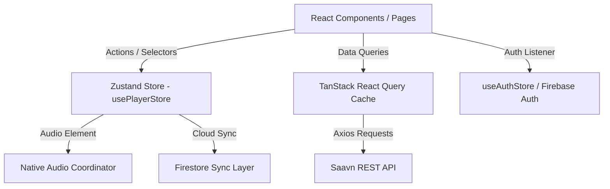

# Melody - Architecture & Production Guidelines

This document outlines the software architecture, design systems, performance optimizations, and security policies governing the Melody streaming client.

---

## 1. System Architecture

Melody is built as a single-page React application powered by Vite, Zustand, and TanStack Query.



### State Management Strategy
- **Zustand (`src/store/usePlayerStore.js`)**: Coordinates music playback state (active song, queue, loop/shuffle parameters).
  - *Performance Guideline*: Always select properties individually (e.g., `usePlayerStore(state => state.activeSong)`) to isolate components from frequent playback progress ticks.
- **TanStack Query (`src/App.jsx` client)**: Manages asynchronous caching for search catalog and regional pages.
  - *Caching configuration*: Static music catalog responses are held with a `staleTime` of 10 minutes and `gcTime` of 45 minutes to eliminate redundant back-and-forth network calls.

---

## 2. Directory Structure

The codebase is organized into high-cohesion, decoupled modules:

```text
├── .github/workflows/   # CI/CD pipelines (compilation and lint checks)
├── public/              # Static PWA assets (local maskable icons)
├── src/
│   ├── api/             # REST client integrations (Saavn endpoints)
│   ├── components/      # Reusable visual components (Navbar, Sidebar, VideoGrid)
│   │   └── player/      # Playback layout parts (MiniPlayer, DesktopPlayerBar)
│   ├── hooks/           # custom React Hooks (useDocumentTitle, useToast)
│   ├── pages/           # Route-level views (Home, Playlists, Settings)
│   ├── store/           # Global state micro-stores (Zustand)
│   ├── utils/           # Clamped math, sanitizations, and secure logging helpers
│   ├── App.jsx          # Route declarations & global backdrops
│   ├── main.jsx         # App startup entry point & core ErrorBoundary
│   └── index.css        # Global CSS design tokens
```

---

## 3. Design System & Theming

The application themes are permanently set to a premium glassmorphic dark mode layout:
- **Unified Color Fields**: Global glowing nodes (`.ambient-glow-1`, `.ambient-glow-2`) are placed behind floating elements, ensuring visual depth across views.
- **Blur Tokens**: All components utilize a standardized `.glass-surface` token (blended at `36px` backdrop-blur opacity and border outline highlights) to match modern Spotify and Apple Music designs.

---

## 4. Security Policy & Audits

We maintain strict security guardrails across the platform:
- **Content-Security-Policy (CSP)**: Placed inside `vercel.json` headers to deny clickjacking (`X-Frame-Options: DENY`) and restrict script execution, font references, API domains, and media source streams to verified JioSaavn CDN and Firebase domains.
- **Data Validation & Sanitization**: 
  - Text fields from API responses are clamped to a max length of `180` characters.
  - Special strings are HTML-decoded and stripped of potential injection markers.
  - Database schema shapes are validated inside backend `firestore.rules` against a default deny-all fallback.
- **Token Shielding Logger**: console messages go through `src/utils/logger.js`, which strips API keys/JWTs and hides debug details in production builds.

---

## 5. CI/CD & Deployment

A GitHub Actions pipeline (`.github/workflows/deploy.yml`) runs on main branch pushes and pull requests:
1. **Checkout & Cache setup**: Checks out code and mounts node modules from cache.
2. **ESLint audit**: Executes code validation with zero warnings allowed.
3. **Production build compilation**: Audits Vite bundle outputs.
